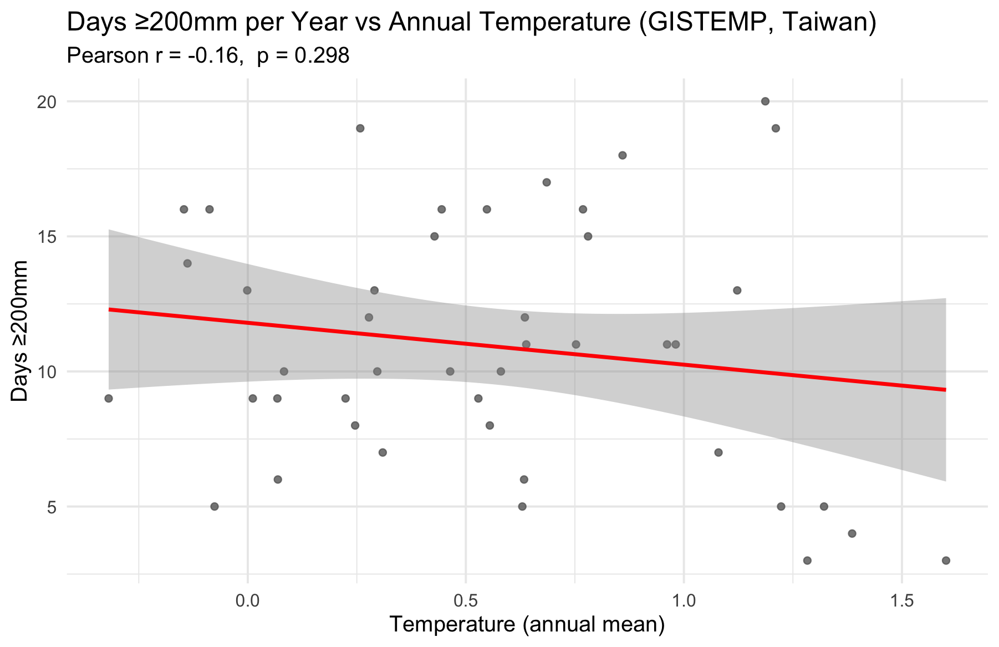

# Global Warming and Extreme Rainfall in Taiwan

## Overview
This project examines whether long-term global warming is associated with changes in extreme rainfall patterns in Taiwan. Using NASA GISTEMP temperature anomalies and CHIRPS precipitation data, it evaluates warming trends, extreme rainfall indicators, and their statistical relationship at the annual scale.

## Data
- NASA GISTEMP (Land–Ocean Temperature Index, 1200 km smoothing)
- CHIRPS v2.0 daily precipitation (0.05°)
- Taiwan gridded monthly rainfall data

Region: 119–123°E, 21–26°N.

## Methods
- Area-mean temperature anomaly extraction and moving average smoothing.
- Extreme rainfall indices: Rx1day, Rx5day, and exceedance counts (≥200/350/500 mm).
- Annual aggregation and Pearson correlation analysis with linear regression.

## Results
- Clear long-term warming trend consistent with global patterns.
- No sustained increasing trend in extreme rainfall indicators.
- Weak and statistically insignificant correlation between annual temperature anomaly and extreme rainfall frequency (r ≈ -0.16, p ≈ 0.30).

## Interpretation
At the annual scale, extreme rainfall variability in Taiwan is not linearly explained by mean temperature anomaly alone. Regional factors (e.g., typhoon activity, large-scale circulation) likely dominate.

## Limitations
- Annual aggregation may obscure seasonal dynamics.
- Linear correlation only; no nonlinear or extreme-value modeling.
- No explicit ENSO/PDO/typhoon indices included.

## Future Work
- Seasonal decomposition (monsoon vs typhoon season).
- Incorporate large-scale climate indices.
- Extreme value theory (GEV) modeling.
- Nonlinear and lagged relationship analysis.

## Reproducibility
python Tool/chrips_tw_daily.py
Rscript R/TaiwanLandTemp.R
Rscript R/RainFall_daily.R
Rscript R/RainFall_monthly.R
